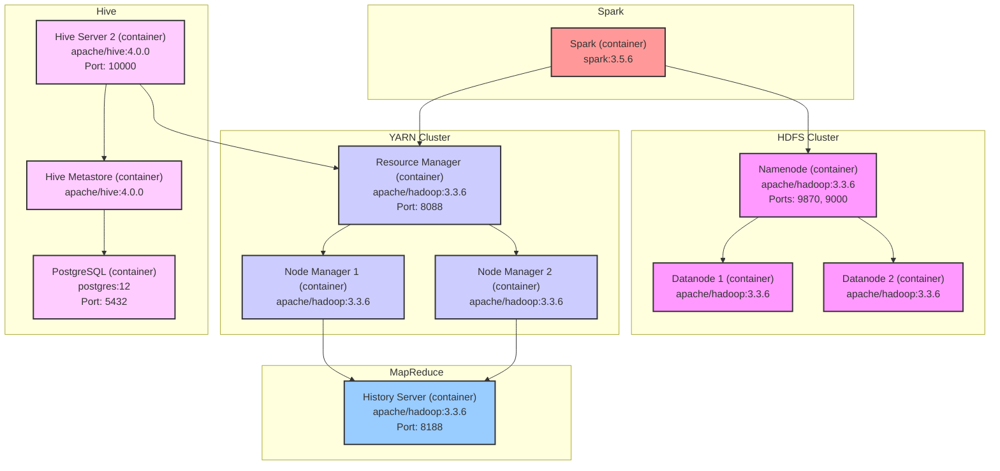

# Hadoop Cluster Architecture

This document outlines the architecture of the Docker-based Hadoop cluster.

## Diagram

### Explanation of the Architecture:

*   **HDFS Cluster**: This is your distributed file system.
    *   `Namenode`: The master node that manages the file system namespace and regulates access to files by clients.
    *   `Datanode`s: The worker nodes that store the actual data blocks.

*   **YARN Cluster**: This is your resource management layer.
    *   `Resource Manager`: The master node that manages and allocates cluster resources.
    *   `Node Manager`s: The worker nodes that are responsible for launching and monitoring containers on the data nodes.

*   **Hive**: This provides a SQL-like interface to query data stored in HDFS.
    *   `PostgreSQL`: The database used by the Hive Metastore to store metadata about the tables, schemas, etc.
    *   `Hive Metastore`: The service that stores the Hive metadata.
    *   `Hive Server 2`: Allows clients to execute queries against Hive.

*   **Spark**: A unified analytics engine for large-scale data processing. Your `spark` service is configured to connect to the Hadoop cluster.

*   **MapReduce**:
    *   `History Server`: Provides a web UI to view information about completed MapReduce jobs.

### Docker Implementation Details

The entire cluster is defined in the `hadoop-cluster/docker-compose.yml` file and orchestrated using Docker Compose.

*   **Services as Containers**: Each component of the architecture (Namenode, Datanodes, etc.) runs as a separate Docker container, defined as a service in the `docker-compose.yml` file.

*   **Networking**: All services are connected to a custom bridge network named `hadoop_network`. This allows the containers to communicate with each other using their service names as hostnames (e.g., `namenode`, `postgres`).

*   **Data Persistence**: Docker named volumes are used to persist data across container restarts. This is crucial for HDFS data and the PostgreSQL database.
    *   `namenode_data`: Stores the HDFS metadata.
    *   `datanode1_data`, `datanode2_data`: Store the HDFS data blocks for each datanode.
    *   `postgres-data`: Stores the data for the PostgreSQL database.

*   **Configuration**: A named volume `hadoop_config` is used to share the Hadoop configuration files (`core-site.xml`, `hdfs-site.xml`, etc.) among all the Hadoop-related containers. An initialization container `config-init` is used to populate this volume from the files in the `hadoop-cluster/config/hadoop` directory.
